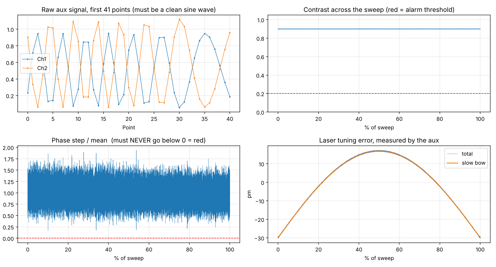

# PIC Reflectometer Toolkit

Signal processing for **optical frequency-domain reflectometry (OFDR)** in Python: turn the raw
detector signals of a swept-laser interferometer into a reflectogram that shows every reflection
along a fiber or photonic integrated circuit with micrometer resolution.


## The idea

A tunable laser sweeps across tens of nanometers. Light reflected from the device under test
interferes with a reference, and each reflector at distance *z* adds a beat tone whose frequency
is proportional to *z*:

```
I(ν) = Σᵢ 2·√(P_ref·Pᵢ)·cos(2π·τᵢ·ν + φᵢ),      τᵢ = 2·n_g·zᵢ / c
```

A Fourier transform over the optical frequency ν therefore gives the reflections as peaks. The
catch: no laser sweeps perfectly linearly. A slow bow and fast ripple in ν(t) smear every peak.

This toolkit records a second, **auxiliary Mach-Zehnder interferometer** alongside the
measurement. Its phase φ(t) = 2π·τ_aux·ν(t) is a ruler for the true optical frequency. Resampling
the measurement onto uniform steps of φ makes the frequency axis exactly linear, however
irregular the sweep was, and the FFT gives sharp, correctly placed peaks.

## Features

- **Processing pipeline** (`ofdr/process.py`): balanced detection, aux-phase resampling,
  windowing, FFT, peak list, harmonic detection, noise-floor and dynamic-range estimate,
  and a check of the peak width against the window's own resolution limit
- **Aux acceptance test** (`ofdr/check_aux.py`): fringe contrast, laser monotonicity
  (go/no-go), calibration of τ_aux by fringe counting, and measured tuning bow and ripple

  
- **Sweep planner** (`ofdr/sweep_calculator.py`): from point count, sweep speed and span to
  resolution, range and whether the aux fits inside the Nyquist range
- **Simulator with ground truth** (`simulation/simulate.py`): synthetic 4-channel captures with
  sweep bow, tuning ripple, gain drift, detector noise, saturation, dispersion and
  double-bounce ghost reflections
- **Validation harness** (`simulation/validate.py`): 14 scenarios that test resolution,
  weak-signal floor, aliasing beyond Nyquist, robustness to sweep errors, calibration errors
  and dispersion against known truth. Some scenarios are expected to fail: they document
  where the method breaks (ripple beyond the monotonicity limit, a mis-calibrated τ_aux)

## Quick start

```bash
python -m pip install -r requirements.txt

# 1. simulate a sweep with reflectors at 4.6 cm, 30 cm, 1.05 m and 2 m
python -m simulation.simulate --out testdata.npz

# 2. check the aux interferometer and calibrate tau_aux
python -m ofdr.check_aux testdata.npz --lam-start 1535 --lam-stop 1595

# 3. compute the reflectogram (writes CSV + PNG, compares against ground truth)
python -m ofdr.process testdata.npz --dl 4 --zmax 2.2

# run the tests
python -m pytest tests/
```

On the simulated data, all four reflectors are found within ±8 µm at a resolution of 14.2 µm
and a range of 6.9 m.

## Data format

A capture is a NumPy `.npz` file with the four detector channels `ch1`…`ch4`, sampled uniformly
in time: `ch1`/`ch2` are the complementary outputs of the aux interferometer, `ch3`/`ch4` those
of the measurement interferometer. The channel assignment can be changed with
`--aux-a/--aux-b/--meas-a/--meas-b`.

## Tech

Python · NumPy · SciPy (PCHIP interpolation, signal windows, peak finding) · matplotlib · pytest
